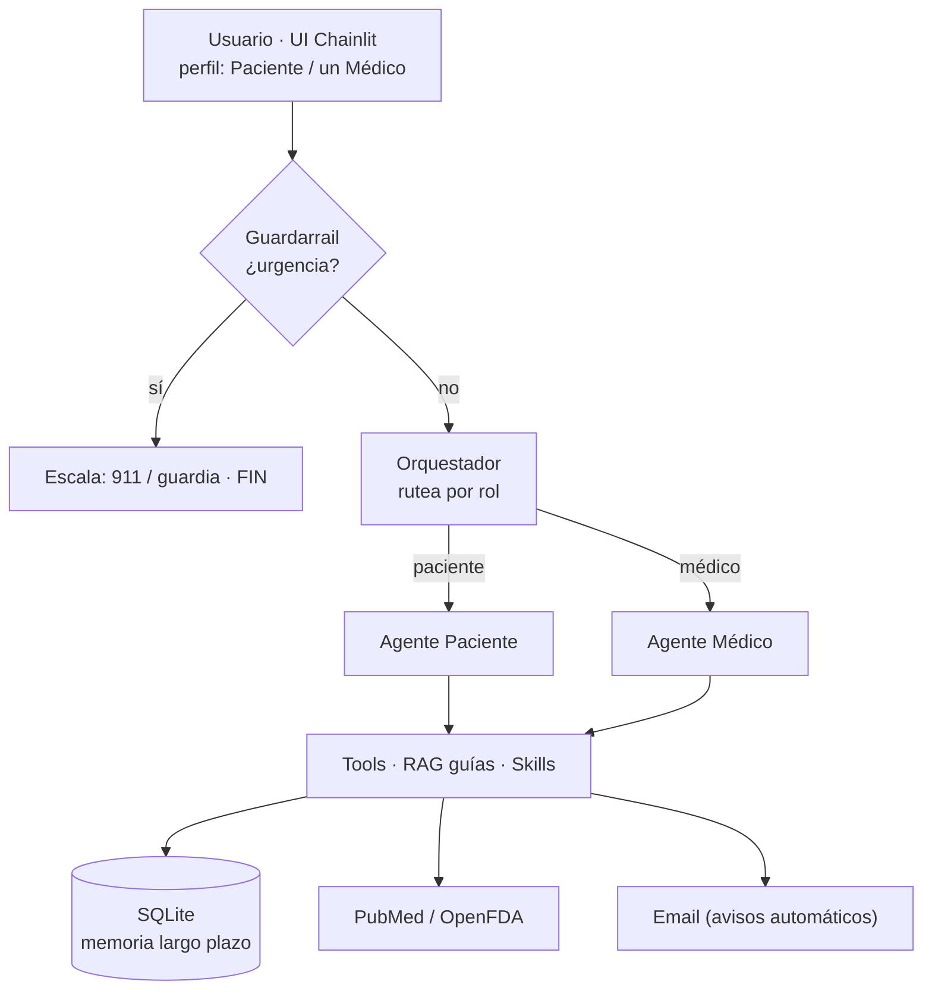

# Agente Consultorio Médico

Sistema **multi-agente de IA** para la gestión de un consultorio de medicina familiar,
desarrollado como trabajo práctico para el curso de Agentes de IA (ITBA).

Pensado para un médico de familia que atiende pacientes con enfermedades crónicas
(hipertensión, diabetes tipo 2, obesidad, dislipemia).

## Descripción

El sistema conecta **dos agentes especializados** a través de un **orquestador** central,
con un **guardarrail de urgencias** como primer filtro. El centro tiene **varios médicos**:
la agenda, los turnos y las solicitudes (recetas/consultas) son **por médico**.

- **Agente Paciente**: registrarse (ingreso guiado con datos filiatorios + obra social y
  **plan**), sacar/cancelar turnos **eligiendo médico**, solicitar recetas dirigidas a un
  médico, dudas sobre hábitos saludables (RAG sobre guías de educación al paciente).
- **Agente Médico**: se elige **qué médico sos** al entrar; ve **su** agenda del día con la
  info del paciente, aprueba/rechaza **sus** recetas y **responde** consultas de pacientes
  (human-in-the-loop), consulta medicamentos (OpenFDA), guías clínicas profesionales y
  evidencia (PubMed). Al **aprobar una receta se genera un PDF** (demo) que se envía al paciente.

Al paciente se lo **identifica por DNI** (no se asume quién es). Y el sistema envía
**notificaciones por email automáticas**:

- **Al paciente**: turno confirmado/cancelado, receta aprobada/rechazada (con el **PDF adjunto**),
  y la respuesta del médico a su consulta.
- **Al consultorio**: cuando entra una receta o consulta nueva, la casilla del consultorio
  recibe un aviso para revisarla (aunque el médico no esté en el chat).

---

## Cómo funciona (arquitectura)

### El recorrido de una conversación

```
   Usuario (UI Chainlit) — elige perfil: Paciente, o uno de los médicos del centro
                              │  escribe un mensaje
                              ▼
                    ┌───────────────────┐
                    │   GUARDARRAIL     │ ── ¿es una urgencia? ──► SÍ: "Llamá al 911 /
                    │  (palabras clave) │                              andá a la guardia" (FIN)
                    └─────────┬─────────┘
                              │ no
                              ▼
                    ┌───────────────────┐
                    │   ORQUESTADOR     │  rutea según el rol
                    └────┬─────────┬────┘
                paciente │         │ médico
                         ▼         ▼
           ┌──────────────────┐  ┌──────────────────┐
           │  AGENTE PACIENTE │  │  AGENTE MÉDICO   │  (el LLM decide qué herramienta usar)
           └────────┬─────────┘  └─────────┬────────┘
                    └──────────┬───────────┘
                               ▼
        ┌───────────────────────────────────────────────────────────┐
        │  TOOLS            RAG guías        Skills        APIs        │
        │  turnos, recetas, (ChromaDB,       (playbooks    (PubMed,    │
        │  aprobar, memoria  guías en PDF)   .md)          OpenFDA)    │
        └───────────────┬───────────────────────────────────┬────────┘
                        ▼                                   ▼
              ┌──────────────────┐                 servicios externos
              │  SQLite (datos)  │ ◄── memoria de largo plazo
              └──────────────────┘
```

<details>
<summary></summary>


</details>

### Qué hace cada archivo

| Archivo | Fase | Qué hace |
|---|---|---|
| `agente_consultorio/db.py` | 1 | Crea las **7 tablas** SQLite (pacientes, médicos, agenda, turnos, solicitudes, historial), carga datos de ejemplo (idempotente) y expone la conexión `conn`. Agenda/turnos/solicitudes son **por médico**. |
| `agente_consultorio/tools.py` | 1 | Las **herramientas** (`@tool`): listar médicos, sacar/ver turnos (por día o por semana), estado de recetas, pedir/aprobar recetas por médico, **responder consultas**, PubMed/OpenFDA, memoria… Usan `conn` de `db.py`. |
| `agente_consultorio/llm.py` | 2 | **Factory de LLM con failover**: elige el modelo (LM Studio local → Groq, y **Claude** opcional de pago). Si uno se cae o se queda sin cuota, pasa al siguiente. |
| `agente_consultorio/recetas_pdf.py` | 5 | Genera el **PDF de la receta** (demo, sin validez legal) cuando el médico la aprueba: datos del paciente/médico, matrícula ficticia, `Rp/`, diagnóstico y firma. |
| `agente_consultorio/grafo.py` | 2 | El **cerebro**: arma el grafo LangGraph (guardarrail → orquestador → agentes → tools), define los prompts de cada agente y la **memoria de corto plazo** (`MemorySaver`). |
| `agente_consultorio/rag.py` | 3 | **RAG por audiencia**: indexa en ChromaDB los PDF de `guias_pdf/paciente/` y `guias_pdf/medico/` por separado. Tools `consultar_guias` (paciente) y `consultar_guias_medico` (profesional). |
| `agente_consultorio/guardarrailes.py` | 4 | **Guardarrail de urgencias**: detecta síntomas de alarma por palabras clave para escalar (911/guardia). |
| `agente_consultorio/skills_loader.py` | 5 | **Skills**: carga playbooks (`skills/*.md`) on-demand con la tool `cargar_skill`. |
| `agente_consultorio/integraciones.py` | 5 | **Notificaciones por email** (Gmail + app password): `enviar_email` (con **adjuntos**, ej. la receta en PDF), avisos automáticos al paciente y aviso al **consultorio** cuando entra una solicitud nueva. |
| `app.py` | 7 | La **UI web** (Chainlit) que envuelve el grafo. |
| `tests/test_evaluacion.py` | 6 | **Evaluación**: funcionales (tools) + guardarrailes + LLM-as-judge. |
| `ver_db.py` | — | Utilidad para **ver el estado** de la base (turnos, recetas): confirma que las acciones se guardan. |
| `skills/*.md` | 5 | Los playbooks (ingreso de paciente y turno, educación en hábitos, protocolo de receta). |
| `data/guias_pdf/` | 3 | Los PDF de guías clínicas que alimentan el RAG. |
| `.env` | — | Claves y configuración (no se sube al repo). |

### Recorrido de un mensaje (ejemplo)

Un paciente escribe *"quiero un turno para mañana"*:

1. **Chainlit** manda el mensaje al grafo con `rol=paciente`.
2. **Guardarrail**: no hay palabras de urgencia → sigue.
3. **Orquestador**: como el rol es paciente → va al **Agente Paciente**.
4. **Agente Paciente** (LLM): lo **identifica por DNI** con `buscar_paciente`. Si NO existe, lo
   registra (datos + plan); si YA existe, lo saluda y sigue. Le muestra los **médicos**
   (`listar_medicos`) y le pide elegir. Sabe la fecha de hoy (se la inyectamos), calcula
   "mañana", confirma, y llama `sacar_turno` con el `medico_id` elegido.
5. La **tool** escribe el turno en **SQLite** (acción real) y **manda un email automático**
   de confirmación al paciente.
6. El agente redacta la confirmación y vuelve a la UI.

Del otro lado: cuando un **médico** entra, elige **qué médico es**; el agente recibe su
`medico_id` y, al saludar, le ofrece revisar **sus** pendientes (no los de los colegas).
Al **aprobar una receta** se genera el **PDF** y se le manda al paciente adjunto por email;
al **responder una consulta**, la respuesta también le llega por email.

> Las conversaciones y sus resúmenes quedan en la tabla `historial_conversaciones`
> (memoria de largo plazo), así el agente "recuerda" interacciones pasadas del paciente.

---

## Tecnologías

| Componente | Tecnología |
|---|---|
| LLM | LM Studio local (modelo Instruct) como primario + failover a Groq (gratis) · Claude opcional (de pago, tool-calling confiable) |
| Framework de agentes | LangGraph + LangChain |
| Embeddings | HuggingFace `paraphrase-multilingual-MiniLM-L12-v2` (multilingüe) |
| Vector store | ChromaDB |
| Base de datos | SQLite |
| APIs externas | PubMed (evidencia) · OpenFDA (medicamentos) — gratis |
| Notificaciones | Email (Gmail SMTP + contraseña de aplicación), con adjuntos |
| Documentos | reportlab (genera el PDF de la receta) |
| Observabilidad | LangSmith (tracing) |
| UI | Chainlit |

Todo open source y gratuito.

## Estructura del proyecto

```
agente-consultorio/
├── agente_consultorio/
│   ├── db.py                 # Fase 1: DB (esquema + datos + conexión)
│   ├── tools.py              # Fase 1: las tools (@tool)
│   ├── llm.py                # Fase 2: LLM con failover multi-proveedor
│   ├── grafo.py              # Fase 2: grafo LangGraph multi-agente
│   ├── rag.py                # Fase 3: RAG de guías clínicas
│   ├── guardarrailes.py      # Fase 4: guardarrail de urgencias
│   ├── skills_loader.py      # Fase 5: skills (playbooks)
│   ├── integraciones.py      # Fase 5: notificaciones por email (con adjuntos)
│   └── recetas_pdf.py        # Fase 5: genera el PDF de la receta al aprobarla
├── recetas_generadas/        # PDFs de recetas generadas (no se sube al repo)
├── skills/                   # Fase 5: playbooks .md
├── data/guias_pdf/
│   ├── paciente/             # Fase 3: guías de educación al paciente (RAG paciente)
│   └── medico/               # Fase 3: guías clínicas profesionales (RAG médico)
├── tests/test_evaluacion.py  # Fase 6: pipeline de evaluación
├── app.py                    # Fase 7: UI Chainlit
├── ver_db.py                 # utilidad: ver el estado de la base
├── requirements.txt
├── .env.example
└── README.md
```

## Setup y cómo correr

```powershell
# 1. Entorno (Python 3.12)
python -m venv .venv
.venv\Scripts\Activate.ps1        # Windows (Linux/Mac: source .venv/bin/activate)
pip install -r requirements.txt

# 2. Configuración: copiar y completar el .env
copy .env.example .env
# El LLM primario es LM Studio local (gratis, sin claves): alcanza con levantar su server.
# Opcional: cargar GROQ_API_KEY (gratis) o ANTHROPIC_API_KEY (Claude, de pago) y LangSmith.

# 3. Indexar las guías clínicas (una vez, y cada vez que cambies los PDFs)
python agente_consultorio/rag.py

# 4. Levantar la UI
chainlit run app.py              # se abre en http://localhost:8000

# (opcional) correr la evaluación
python tests/test_evaluacion.py
```

## Requisitos del TP cubiertos

- [x] **RAG** — Guías clínicas en PDF (HTA, DM2, hábitos) indexadas en ChromaDB.
- [x] **Herramientas** — Tools de turnos, recetas y agenda + APIs externas (PubMed, OpenFDA).
- [x] **Guardarrailes** — Escalar urgencias, no diagnosticar, confirmar acciones, validar datos.
- [x] **Evaluación** — Pipeline: casos funcionales + guardarrailes + LLM-as-judge.
- [x] **Múltiples agentes** (plus) — Orquestador + agente paciente + agente médico.
- [x] **Human-in-the-loop** (plus) — El médico aprueba/rechaza recetas (con **PDF** generado) y responde consultas; el paciente recibe todo por email.
- [x] **Memoria** — Corto plazo (estado LangGraph) y largo plazo (SQLite).
- [x] **Skills** — Playbooks modulares que el agente carga on-demand.

## Autor

María Constanza Florio — Maestría en Ciencia de Datos, ITBA
