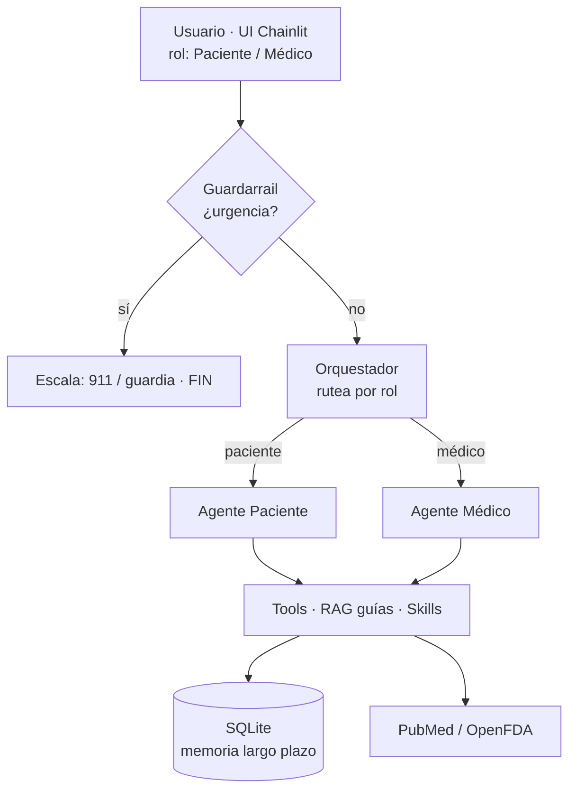

# Agente Consultorio Médico

Sistema **multi-agente de IA** para la gestión de un consultorio de medicina familiar,
desarrollado como trabajo práctico para el curso de Agentes de IA (ITBA).

Pensado para un médico de familia que atiende pacientes con enfermedades crónicas
(hipertensión, diabetes tipo 2, obesidad, dislipemia).

## Descripción

El sistema conecta **dos agentes especializados** a través de un **orquestador** central,
con un **guardarrail de urgencias** como primer filtro:

- **Agente Paciente**: sacar/cancelar turnos, registrarse, solicitar recetas, dudas sobre
  hábitos saludables (respondidas con RAG sobre guías clínicas).
- **Agente Médico**: agenda del día con info del paciente, aprobar/rechazar solicitudes
  (human-in-the-loop), consultar medicamentos (OpenFDA) y evidencia científica (PubMed),
  seguimiento de pacientes crónicos.

---

## Cómo funciona (arquitectura)

### El recorrido de una conversación

```
        Usuario (UI Chainlit) — elige rol: Paciente o Médico
                              │  escribe un mensaje
                              ▼
                    ┌───────────────────┐
                    │   GUARDARRAIL     │ ── ¿es una urgencia? ──► SÍ: "Llamá al 911 /
                    │  (palabras clave) │                              andá a la guardia" (FIN)
                    └─────────┬─────────┘
                              │ no
                              ▼
                    ┌───────────────────┐
                    │   ORQUESTADOR     │  rutea según el rol
                    └────┬─────────┬────┘
                paciente │         │ médico
                         ▼         ▼
           ┌──────────────────┐  ┌──────────────────┐
           │  AGENTE PACIENTE │  │  AGENTE MÉDICO   │  (el LLM decide qué herramienta usar)
           └────────┬─────────┘  └─────────┬────────┘
                    └──────────┬───────────┘
                               ▼
        ┌───────────────────────────────────────────────────────────┐
        │  TOOLS            RAG guías        Skills        APIs        │
        │  turnos, recetas, (ChromaDB,       (playbooks    (PubMed,    │
        │  aprobar, memoria  guías en PDF)   .md)          OpenFDA)    │
        └───────────────┬───────────────────────────────────┬────────┘
                        ▼                                   ▼
              ┌──────────────────┐                 servicios externos
              │  SQLite (datos)  │ ◄── memoria de largo plazo
              └──────────────────┘
```

<details>
<summary>El mismo diagrama en Mermaid (se ve renderizado en GitHub)</summary>


</details>

### Qué hace cada archivo

| Archivo | Fase | Qué hace |
|---|---|---|
| `agente_consultorio/db.py` | 1 | Crea las **6 tablas** SQLite, carga datos de ejemplo (idempotente) y expone la conexión `conn`. |
| `agente_consultorio/tools.py` | 1 | Las **herramientas** (`@tool`) que el agente puede ejecutar: sacar turno, pedir receta, aprobar, buscar en PubMed/OpenFDA, memoria… Usan `conn` de `db.py`. |
| `agente_consultorio/llm.py` | 2 | **Factory de LLM con failover**: elige el modelo (LM Studio local → Gemini → Groq → HuggingFace). Si uno se cae o se queda sin cuota, pasa al siguiente. |
| `agente_consultorio/grafo.py` | 2 | El **cerebro**: arma el grafo LangGraph (guardarrail → orquestador → agentes → tools), define los prompts de cada agente y la **memoria de corto plazo** (`MemorySaver`). |
| `agente_consultorio/rag.py` | 3 | **RAG**: lee los PDF de guías, los parte en fragmentos, los indexa en ChromaDB y ofrece la tool `consultar_guias`. |
| `agente_consultorio/guardarrailes.py` | 4 | **Guardarrail de urgencias**: detecta síntomas de alarma por palabras clave para escalar (911/guardia). |
| `agente_consultorio/skills_loader.py` | 5 | **Skills**: carga playbooks (`skills/*.md`) on-demand con la tool `cargar_skill`. |
| `app.py` | 7 | La **UI web** (Chainlit) que envuelve el grafo. |
| `tests/test_evaluacion.py` | 6 | **Evaluación**: funcionales (tools) + guardarrailes + LLM-as-judge. |
| `ver_db.py` | — | Utilidad para **ver el estado** de la base (turnos, recetas): confirma que las acciones se guardan. |
| `skills/*.md` | 5 | Los playbooks (educación en hábitos, protocolo de receta). |
| `data/guias_pdf/` | 3 | Los PDF de guías clínicas que alimentan el RAG. |
| `.env` | — | Claves y configuración (no se sube al repo). |

### Recorrido de un mensaje (ejemplo)

Un paciente escribe *"quiero un turno para mañana"*:

1. **Chainlit** manda el mensaje al grafo con `rol=paciente`.
2. **Guardarrail**: no hay palabras de urgencia → sigue.
3. **Orquestador**: como el rol es paciente → va al **Agente Paciente**.
4. **Agente Paciente** (LLM): sabe la fecha de hoy (se la inyectamos en el prompt), calcula
   qué día es "mañana", confirma con el paciente y llama la tool `sacar_turno`.
5. La **tool** escribe el turno en **SQLite** → acción real y persistente.
6. El agente redacta la confirmación y vuelve a la UI.

> Las conversaciones y sus resúmenes quedan en la tabla `historial_conversaciones`
> (memoria de largo plazo), así el agente "recuerda" interacciones pasadas del paciente.

---

## Tecnologías

| Componente | Tecnología |
|---|---|
| LLM | LM Studio local (Gemma) como primario + failover cloud (Gemini/Groq/HuggingFace) |
| Framework de agentes | LangGraph + LangChain |
| Embeddings | HuggingFace `paraphrase-multilingual-MiniLM-L12-v2` (multilingüe) |
| Vector store | ChromaDB |
| Base de datos | SQLite |
| APIs externas | PubMed (evidencia) · OpenFDA (medicamentos) — gratis |
| Observabilidad | LangSmith (tracing) |
| UI | Chainlit |

Todo open source y gratuito.

## Estructura del proyecto

```
agente-consultorio/
├── agente_consultorio/
│   ├── db.py                 # Fase 1: DB (esquema + datos + conexión)
│   ├── tools.py              # Fase 1: las tools (@tool)
│   ├── llm.py                # Fase 2: LLM con failover multi-proveedor
│   ├── grafo.py              # Fase 2: grafo LangGraph multi-agente
│   ├── rag.py                # Fase 3: RAG de guías clínicas
│   ├── guardarrailes.py      # Fase 4: guardarrail de urgencias
│   └── skills_loader.py      # Fase 5: skills (playbooks)
├── skills/                   # Fase 5: playbooks .md
├── data/guias_pdf/           # Fase 3: PDFs de guías clínicas
├── tests/test_evaluacion.py  # Fase 6: pipeline de evaluación
├── app.py                    # Fase 7: UI Chainlit
├── ver_db.py                 # utilidad: ver el estado de la base
├── requirements.txt
├── .env.example
└── README.md
```

## Setup y cómo correr

```powershell
# 1. Entorno (Python 3.12)
python -m venv .venv
.venv\Scripts\Activate.ps1        # Windows (Linux/Mac: source .venv/bin/activate)
pip install -r requirements.txt

# 2. Configuración: copiar y completar el .env
copy .env.example .env
# El LLM primario es LM Studio local (gratis, sin claves): alcanza con levantar su server.
# Opcional: cargar claves cloud (Gemini/Groq) y LangSmith en el .env.

# 3. Indexar las guías clínicas (una vez, y cada vez que cambies los PDFs)
python agente_consultorio/rag.py

# 4. Levantar la UI
chainlit run app.py              # se abre en http://localhost:8000

# (opcional) correr la evaluación
python tests/test_evaluacion.py
```

## Requisitos del TP cubiertos

- [x] **RAG** — Guías clínicas en PDF (HTA, DM2, hábitos) indexadas en ChromaDB.
- [x] **Herramientas** — Tools de turnos, recetas y agenda + APIs externas (PubMed, OpenFDA).
- [x] **Guardarrailes** — Escalar urgencias, no diagnosticar, confirmar acciones, validar datos.
- [x] **Evaluación** — Pipeline: casos funcionales + guardarrailes + LLM-as-judge.
- [x] **Múltiples agentes** (plus) — Orquestador + agente paciente + agente médico.
- [x] **Human-in-the-loop** (plus) — El médico aprueba/rechaza recetas y consultas.
- [x] **Memoria** — Corto plazo (estado LangGraph) y largo plazo (SQLite).
- [x] **Skills** — Playbooks modulares que el agente carga on-demand.

## Autor

María Constanza Florio — Maestría en Ciencia de Datos, ITBA
